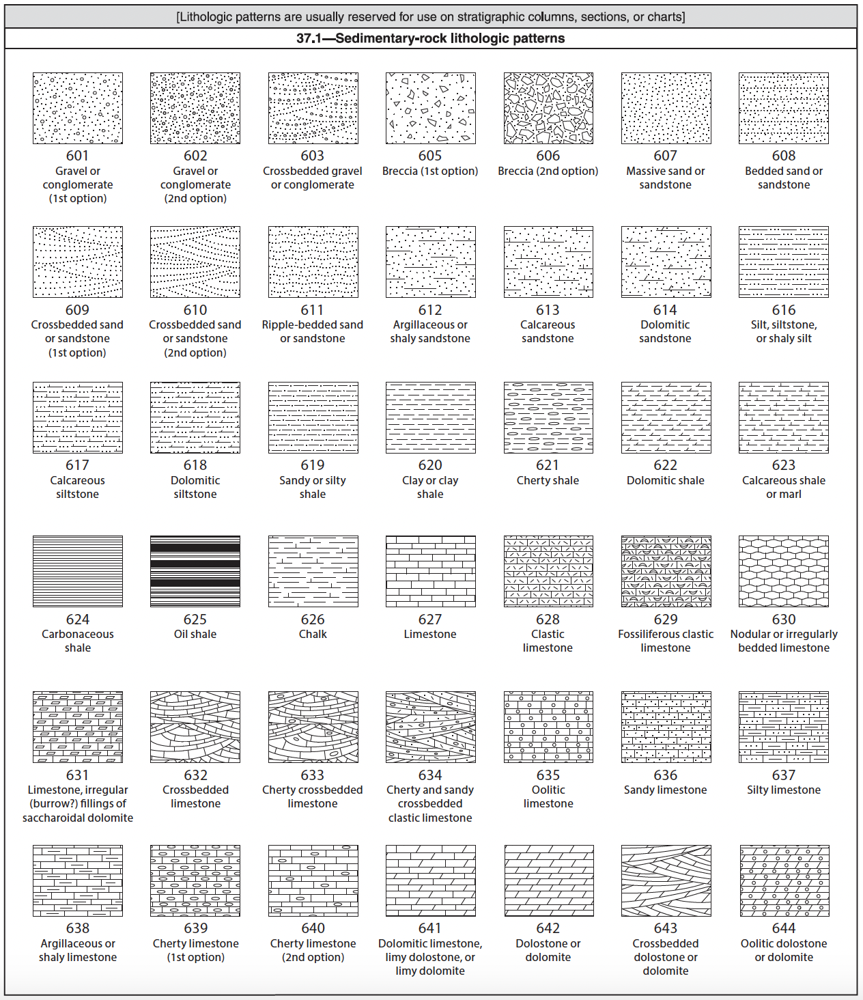
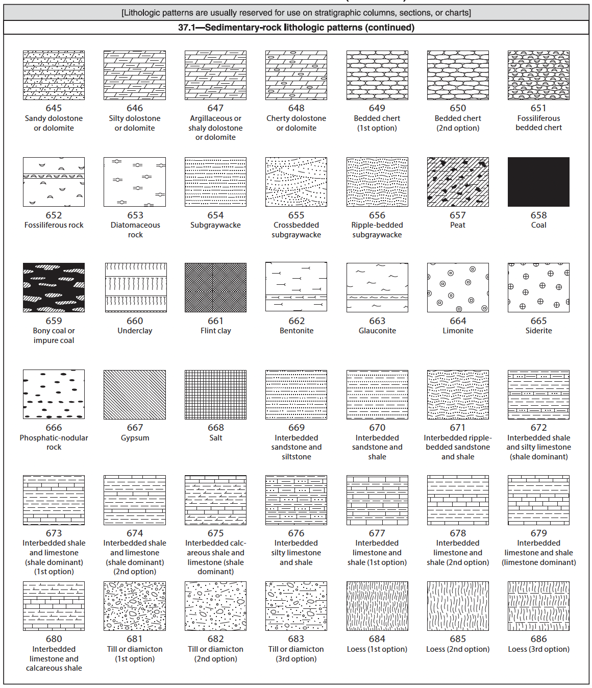
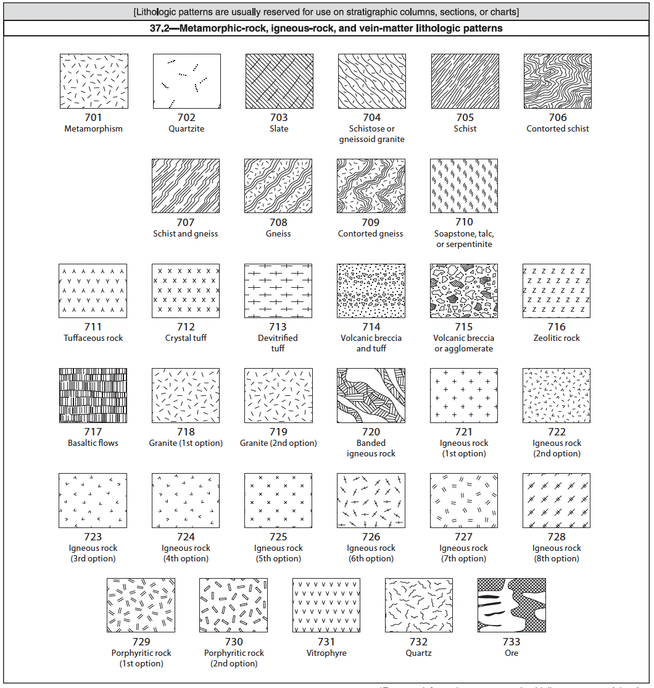

# Lithological Swatches Overview

This document provides a broad overview of lithological swatches available for use within `pystrat`. These lithological aid in the representation of different rock types in stratigraphic columns, sections, and charts. These patterns were developed by the Geologic Data Subcommittee of the Federal Geographic Data Committee and the USGS and were published as *FGDC Digital Cartographic Standard for Geologic Map Symbolization (PostScript Implementation) Techniques and Methods 11-A2* in 2006 (https://pubs.usgs.gov/tm/2006/11A02/FGDCgeostdTM11A2_web_all.pdf).

# Usage in pystrat

The style.csv file can have a column called `swatch` in which the number assigned to the lithological patterns in this USGS document are used.

## Sedimentary-Rock Lithologic Patterns

- **601 Gravel or Conglomerate (1st option)**
- **602 Gravel or Conglomerate (2nd option)**
- **603 Crossbedded Gravel or Conglomerate**
- **605 Breccia (1st option)**
- **606 Breccia (2nd option)**
- **607 Massive Sand or Sandstone**
- **608 Bedded Sand or Sandstone**
- **609 Crossbedded Sand or Sandstone (1st option)**
- **610 Crossbedded Sand or Sandstone (2nd option)**
- **611 Ripple-bedded Sand or Sandstone**
- **612 Argillaceous or Shaly Sandstone**
- **613 Calcareous Sandstone**
- **614 Dolomitic Sandstone**
- **616 Silt, Siltstone, or Shaly Silt**
- **617 Calcareous Siltstone**
- **618 Dolomitic Siltstone**
- **619 Sandy or Silty Shale**
- **620 Clay or Clay Shale**
- **621 Cherty Shale**
- **622 Dolomitic Shale**
- **623 Calcareous Shale or Marl**
- **624 Carbonaceous Shale**
- **625 Oil Shale**
- **626 Chalk**
- **627 Limestone**
- **628 Clastic Limestone**
- **629 Fossiliferous Clastic Limestone**
- **630 Nodular or Irregularly Bedded Limestone**
- **631 Limestone, Irregular (Burrow?) Fillings of Saccharoidal Dolomite**
- **632 Crossbedded Limestone**
- **633 Cherty Crossbedded Limestone**
- **634 Cherty and Sandy Crossbedded Clastic Limestone**
- **635 Oolitic Limestone**
- **636 Sandy Limestone**
- **637 Silty Limestone**
- **638 Argillaceous or Shaly Limestone**
- **639 Cherty Limestone (1st option)**
- **640 Cherty Limestone (2nd option)**
- **641 Dolomitic Limestone, Limy Dolostone, or Limy Dolomite**
- **642 Dolostone or Dolomite**
- **643 Crossbedded Dolostone or Dolomite**
- **644 Oolitic Dolostone or Dolomite**
- **645 Sandy Dolostone or Dolomite**
- **646 Silty Dolostone or Dolomite**
- **647 Argillaceous or Shaly Dolostone or Dolomite**
- **648 Cherty Dolostone or Dolomite**
- **649 Bedded Chert (1st option)**
- **650 Bedded Chert (2nd option)**
- **651 Fossiliferous Bedded Chert**
- **652 Fossiliferous Rock**
- **653 Diatomaceous Rock**
- **654 Subgraywacke**
- **655 Crossbedded Subgraywacke**
- **656 Ripple-bedded Subgraywacke**
- **657 Peat**
- **658 Coal**
- **659 Bony Coal or Impure Coal**
- **660 Underclay**
- **661 Flint Clay**
- **662 Bentonite**
- **663 Glauconite**
- **664 Limonite**
- **665 Siderite**
- **666 Phosphatic-nodular Rock**
- **667 Gypsum**
- **668 Salt**
- **669 Interbedded Sandstone and Siltstone**
- **670 Interbedded Sandstone and Shale**
- **671 Interbedded Ripple-bedded Sandstone and Shale**
- **672 Interbedded Shale and Silty Limestone (shale dominant)**
- **673 Interbedded Shale and Limestone (shale dominant) (1st option)**
- **674 Interbedded Shale and Limestone (shale dominant) (2nd option)**
- **675 Interbedded Calcareous Shale and Limestone (shale dominant)**
- **676 Interbedded Silty Limestone and Shale**
- **677 Interbedded Limestone and Shale (1st option)**
- **678 Interbedded Limestone and Shale (2nd option)**
- **679 Interbedded Limestone and Shale (limestone dominant)**
- **680 Interbedded Limestone and Calcareous Shale**
- **681 Till or Diamicton (1st option)**
- **682 Till or Diamicton (2nd option)**
- **683 Till or Diamicton (3rd option)**
- **684 Loess (1st option)**
- **685 Loess (2nd option)**
- **686 Loess (3rd option)**

## Metamorphic-Rock, Igneous-Rock, and Vein-Matter Lithologic Patterns

**704 Schistose or Gneissoid Granite**
**705 Schist**
**706 Contorted Schist**
**707 Schist and Gneiss**
**708 Gneiss**
**709 Contorted Gneiss**
**710 Soapstone, Talc, or Serpentine**
**711 Tuffaceous Rock**
**712 Crystal Tuff**
**713 Devitrified Tuff**
**714 Volcanic Breccia and Tuff**
**715 Volcanic Breccia or Agglomerate**
**716 Zeolitic Rock**
**717 Basaltic Flows**
**718 Granite (1st option)**
**719 Granite (2nd option)**
**720 Banded Igneous Rock**
**721 Igneous Rock (1st option)**
**722 Igneous Rock (2nd option)**
**723 Igneous Rock (3rd option)**
**724 Igneous Rock (4th option)**
**725 Igneous Rock (5th option)**
**726 Igneous Rock (6th option)**
**727 Igneous Rock (7th option)**
**728 Igneous Rock (8th option)**
**729 Porphyritic Rock (1st option)**
**730 Porphyritic Rock (2nd option)**
**731 Vitrophyre**
**732 Quartz**
**733 Ore**
---
